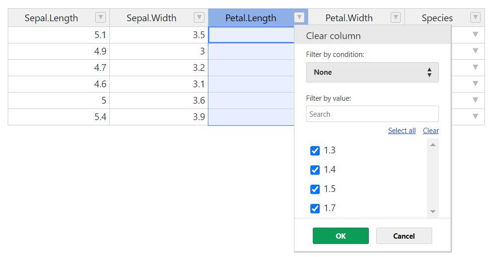

<!-- README.md is generated from README.Rmd. Please edit that file -->

```{r, include = FALSE}
knitr::opts_chunk$set(
  collapse = TRUE,
  comment = "#>",
  fig.path = "man/figures/README-",
  out.width = "100%"
)
```

# hotwidget

<!-- badges: start -->

<!-- badges: end -->

The goal of hotwidget is to provide an interface to the handsontable.js
library. This is mainly intended to use with {Shiny}. The package is
still in development and is not yet available on CRAN.

The reason for this package is that rhandsontable is not being developed
beyond version 0.3.8 due to the need for a license in the case of
commercial use. However, if you have a license, you can use hotwidget
for commercial use.

I've tried to send as little data from client to server in order to
handle larger data sets. The function `hotwidget_update()` can be used
to update the data that you insert into `hotwidget()`. You do need to
pass a reactive object though.

If you would like to independently handle the changes in the client, you
can listen to the various ported hooks from handsontable.js. 

-   afterChange
-   afterCreateRow
-   afterRemoveRow
-   afterUndo
-   afterRedo

Column adding/removing is not implemented yet. 

The listeners update when triggered (so they are NULL at initialization) and can be
accessed via ``input${name_of_widget}_afterchange`` for example. I would suggest you use these hooks if you want to use R to communicate database updates. 

For a more detailed description, take a look at ``inst/htmlwidgets/hotwidget.js``.

## Installation

You can install the development version of hotwidget from
[GitHub](https://github.com/) with:

``` r
# install.packages("devtools")
devtools::install_github("vreederene-90/hotwidget")
```

## Examples

### This is a basic example which shows you how to solve a common problem:

```{r example, eval = FALSE}
library(hotwidget)
hotwidget(head(iris))
```



### A basic Shiny app with hotwidget

```{r shinyexample, eval = FALSE}
library(hotwidget)
run_app <-
  function(
    hotwidget_data =
      iris |>
      janitor::clean_names() |>
      mutate(
        .before = 1,
        index = row_number(),
        test = as_date(paste(Sys.Date()))
      ) |> head(6)) {

    ui <- fluidPage(
      fluidRow(
        column(
          width = 6,
          textInput("name", "name dataset", value = "dataset"),
          hotwidgetOutput("hotwidget"),
          selectInput(
            "select",
            multiple = T,
            choices = c("species", "sepal_length", "sepal_width", "petal_length", "petal_width", "index", "test"),
            label = "select",
            selected = "species"
          )
        ),
        column(
          width = 6,
          h5("hotwidget_data_updated"),
          shiny::verbatimTextOutput("table"),
          column(
            width = 6,
            h5("undo data passed via hotwidget.js"),
            shiny::verbatimTextOutput("undo")
          ),
          column(
            width = 6,
            h5("redo data passed via hotwidget.js"),
            shiny::verbatimTextOutput("redo")
          )
        )
      )
    )

    server <- function(input, output, session) {

      hotwidget_update(input, "hotwidget", hotwidget_data_rv, verbose = TRUE)

      hotwidget_data_rv <- reactiveVal()

      observe(
        hotwidget_data_rv(hotwidget_data |> select(any_of(input$select)))
      )

      output$hotwidget <-
        renderHotwidget(
          {
            hotwidget(
              columnSorting = FALSE,
              undo = TRUE,
              rowHeaders = TRUE,
              licenseKey = 'non-commercial-and-evaluation',
              data = isolate(hotwidget_data_rv())
            )
          }
        ) |> bindEvent(input$select)

      output$undo <- renderPrint(input$hotwidget_afterundo)
      output$redo <- renderPrint(input$hotwidget_afterredo)

      output$table <- renderPrint(hotwidget_data_rv())

      session$onSessionEnded(
        function() {

            assign(
              x = isolate(input$name),
              value = isolate(hotwidget_data_rv()),
              envir = .GlobalEnv
            )
          }
        )

    }
    shinyApp(ui,server)
  }

```
