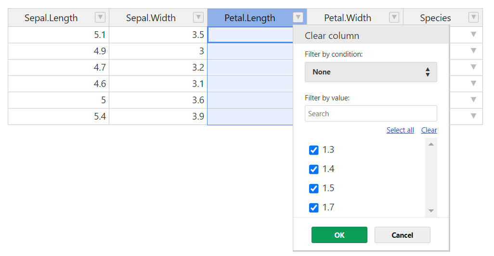

<!-- README.md is generated from README.Rmd. Please edit that file -->

# hotwidget

<!-- badges: start -->
<!-- badges: end -->

The goal of hotwidget is to provide an interface to the handsontable.js
library. This is mainly intended to use with {Shiny}. The package is
still in development and is not yet available on CRAN.

The reason for this package is that rhandsontable is not being developed
beyond version 0.3.8 due to the need for a license in the case of
commercial use. However, if you have a license, you can use hotwidget
for commercial use.

## Installation

You can install the development version of hotwidget from
[GitHub](https://github.com/) with:

``` r
# install.packages("devtools")
devtools::install_github("vreederene-90/hotwidget")
```

## Examples

### This is a basic example which shows you how to solve a common problem:

``` r
library(hotwidget)
hotwidget(head(iris))
```



### A basic Shiny app with hotwidget

``` r
library(hotwidget)
run_app <- function() {
  ui <- fluidPage(
    hotwidgetOutput("hotwidget")
  )

  server <- function(input, output, session) {

    hotwidget_data <-
      iris |>
      janitor::clean_names() |>
      mutate(
        .before = 1,
        test = as_date(paste(Sys.Date()))
      )

    hotwidget_data_updated <- reactiveVal(hotwidget_data)

    observe(
      {
        print("hotwidget_data_updated")
        print(hotwidget_data_updated()|> head())
      }
    )

    hotwidget_update(input, hotwidget_data, hotwidget_data_updated)

    output$hotwidget <-
      renderHotwidget(
        hotwidget(
          licenseKey = 'non-commercial-and-evaluation',
          data = hotwidget_data
        )
      )
  }
  shinyApp(ui,server)
}
```
